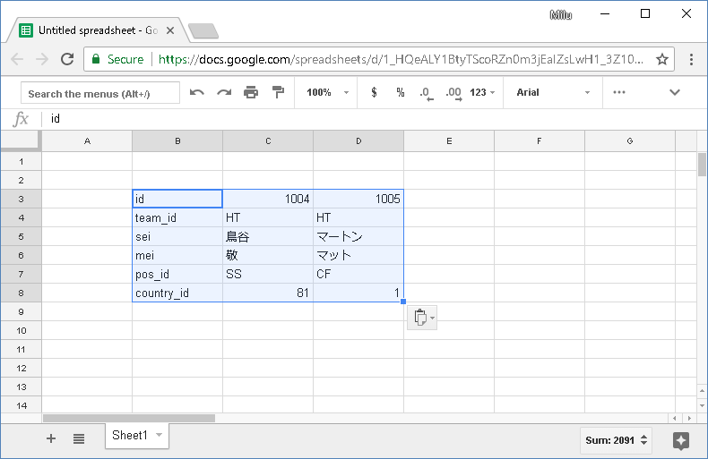
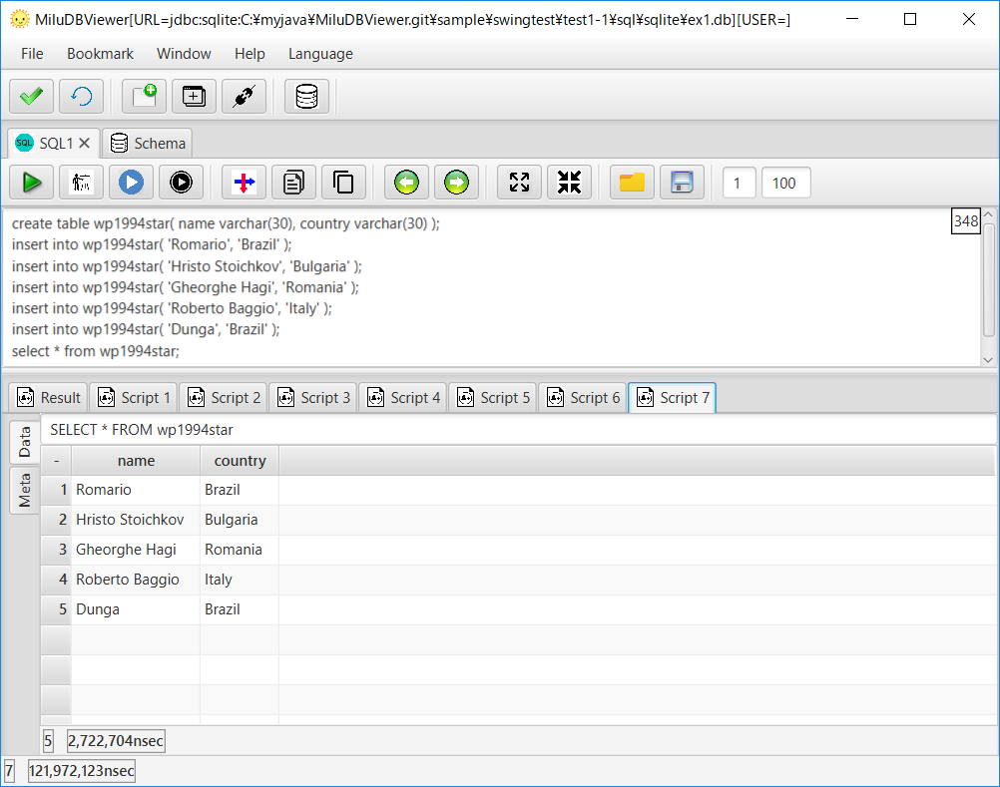

# Overview

- GUI Tool to browse data, issue SQL commands on DB.
- **Supported DB: Oracle, PostgreSQL, MySQL, Cassandra, SQLite**. Going to add more JDBC compliant DB in the future.
- Multi Platform: Windows, Linux, MacOS.
- Multi Language: English, French, Spanish, Chinese, Japanse.
- Free and Open-Source.

# Download

[https://sourceforge.net/projects/miludbviewer/files/?source=navbar](https://sourceforge.net/projects/miludbviewer/files/?source=navbar)

# Features

## Copy data vertically
This is the feature that I want and use the most.
Enable to check data transition by your app.
Especially for tables having many columns.

1. Copy data vertically

2. Paste it to a spreadsheet app like Excel, Open Office, Google spreadsheet.

## Run Script

1. All SQL Results on "Result" Tab.

2. Each SQL Result on "Script#" Tab.

3. Execute selected SQL.

## Completion

1. List popup for competion after "."

## Schema Browse

1. Browse schema objects. Table and View => definition. Procedure => Source.

Supported Objects
x|Table|View|Materialized View|Function|Aggregate|Procedure|Package|Type|Trigger|Sequence
Cassandra|ÅZ|Å~|ÅZ|ÅZ|ÅZ|Å~|Å~|ÅZ|Å~|Å~
MySQL|ÅZ|ÅZ|Å~|ÅZ|Å~|ÅZ|Å~|ÅZ|Å~
Oracle|ÅZ|ÅZ|ÅZ|ÅZ|Å~|ÅZ|ÅZ|ÅZ|ÅZ|ÅZ
PostgreSQL|ÅZ|ÅZ|ÅZ|ÅZ|Å~|Å~|Å~|ÅZ|ÅZ|ÅZ
SQLite|ÅZ|ÅZ|Å~|Å~|Å~|Å~|Å~|Å~|Å~|Å~

## ER Diagram

1. Draw ER diagram through traversing foreign keys.

# Start

- Cassandra
- MySQL
- [Oracle](doc/en/START_Oracle.md)
- [PostgreSQL](doc/en/START_PostgreSQL.md)
- [SQLite](doc/en/START_SQLite.md)

[GitHub Flavored Markdown](https://guides.github.com/features/mastering-markdown/).

