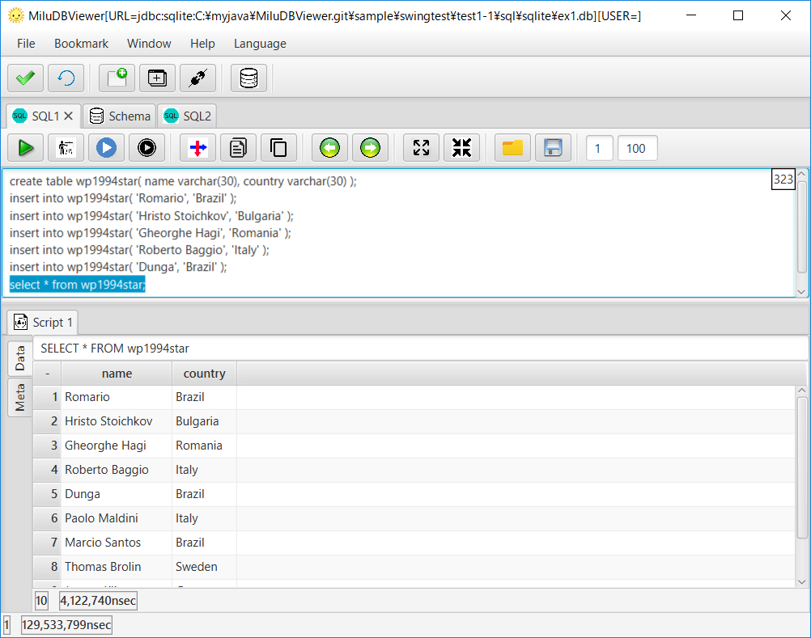
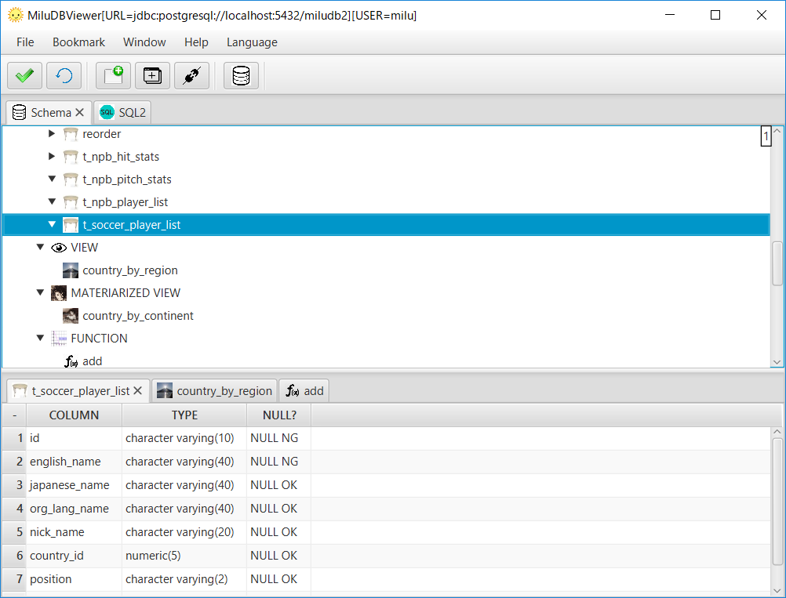

# Overview

- GUI Tool to browse data, issue SQL commands on DB.
- **Supported DB: Oracle, PostgreSQL, MySQL, Cassandra, SQLite**. Going to add more JDBC compliant DB in the future.
- Multi Platform: Windows, Linux, MacOS.
- Multi Language: English, French, Spanish, Chinese, Japanse.
- Free and Open-Source.

## Download

[https://sourceforge.net/projects/miludbviewer/files/?source=navbar](https://sourceforge.net/projects/miludbviewer/files/?source=navbar)

## Features

### Copy data vertically
This is the feature that I want and use the most.
Enable to check data transition by your app.
Especially for tables having many columns.

1. Copy data vertically


2. Paste it to a spreadsheet app like Excel, Open Office, Google spreadsheet.


### Run Script

1. All SQL Results on "Result" Tab.


2. Each SQL Result on "Script#" Tab.


3. Execute selected SQL.


### Completion

1. List popup for competion after "."


### Schema Browse

1. Browse schema objects. Table and View => definition. Procedure => Source.


### ER Diagram

1. Draw ER diagram through traversing foreign keys.


## Start

- Cassandra
- MySQL
- Oracle
- PostgreSQL
- SQLite


```markdown
Syntax highlighted code block

# Header 1
## Header 2
### Header 3

- Bulleted
- List

1. Numbered
2. List

**Bold** and _Italic_ and `Code` text

[Link](url) and 
```

For more details see [GitHub Flavored Markdown](https://guides.github.com/features/mastering-markdown/).

### Jekyll Themes

Your Pages site will use the layout and styles from the Jekyll theme you have selected in your [repository settings](https://github.com/milukiriu2010/MiluDBViewer/settings). The name of this theme is saved in the Jekyll `_config.yml` configuration file.

### Support or Contact

Having trouble with Pages? Check out our [documentation](https://help.github.com/categories/github-pages-basics/) or [contact support](https://github.com/contact) and we’ll help you sort it out.
