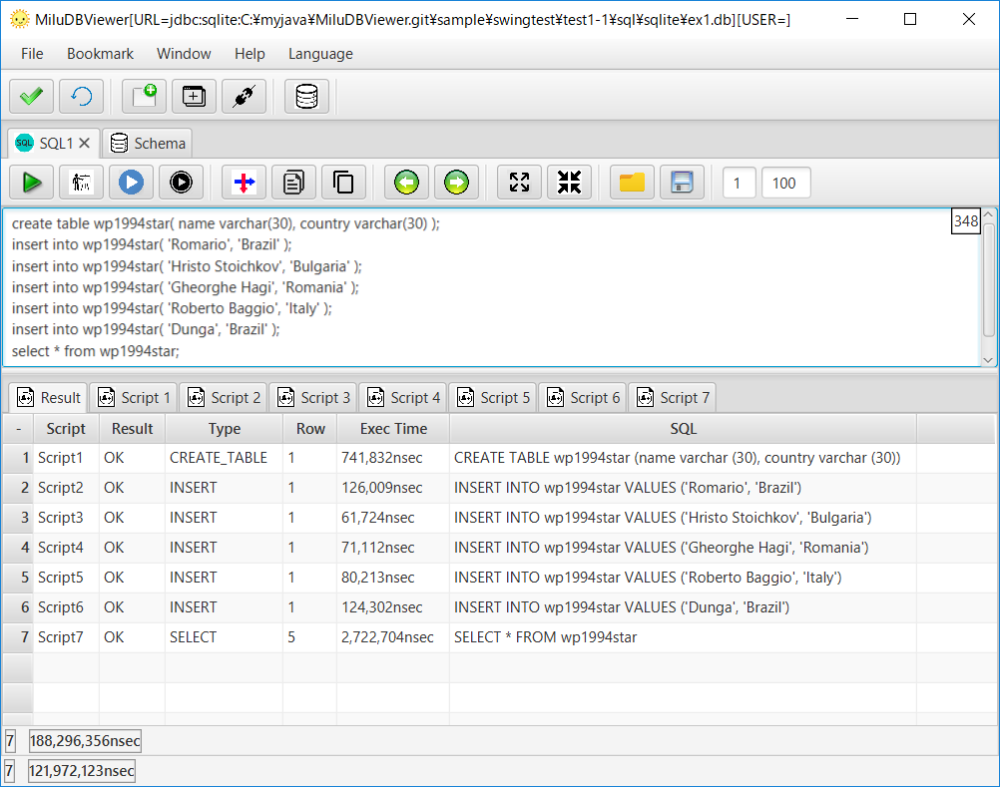

[English](README.md)

# 概要

- DB上のデータ閲覧・SQLコマンドを発行可能なGUIツール
- **サポートしているDB: Oracle, PostgreSQL, MySQL, Cassandra, SQLite, SQLServer**. 将来的には、JDBCに準拠しているDBを、もっと追加する予定です。
- マルチ プラットフォーム: Windows, Linux, MacOS.
- マルチ　言語: 日本語・英語・フランス語・スペイン語・中国語.
- フリー＆オープンソース.

# ダウンロード

[https://sourceforge.net/projects/miludbviewer/files/?source=navbar](https://sourceforge.net/projects/miludbviewer/files/?source=navbar)

# ポイント

## 縦方向のデータコピー
自身で作成したアプリケーションのデータ遷移をチェックするために用います。
たくさんのカラムがあるテーブル上のデータをみるのに、よいかと思います。

1. 縦方向にデータコピー

2. Excel, Open Office, Googleスプレッドシートのような表計算アプリに貼り付けます

## スクリプトの実行

1. "Result"タブに全SQLの実行結果が表示されます

2. "Script#"タブに各SQLの実行結果が表示されます 

3. 選択されたSQLのみの実行も可能です

## 補完

1. "."を契機に補完候補を表示します

## スキーマ表示

1. スキーマがもつデータを表示します。現バージョンでは、"表・ビュー => 定義. プロシージャ => ソース"を表示します.

サポートしているオブジェクト一覧

x|Table|View|Materialized View|Function|Aggregate|Procedure|Package|Type|Trigger|Sequence
-|-----|----|-----------------|--------|---------|---------|-------|----|-------|--------
Cassandra|〇|×|〇|〇|〇|×|×|〇|×|×
MySQL|〇|〇|×|〇|×|〇|×|〇|×
Oracle|〇|〇|〇|〇|×|〇|〇|〇|〇|〇
PostgreSQL|〇|〇|〇|〇|×|×|×|〇|〇|〇
SQLite|〇|〇|×|×|×|×|×|×|×|×
SQLServer|〇|〇|×|〇|×|〇|×|〇|〇|〇

## ER図

1. 外部キーをたどっていくことでER図を作成しています

# DB接続の設定

- [Cassandra](doc/ja/START_Cassandra.md)
- [MySQL](doc/ja/START_MySQL.md)
- [Oracle](doc/ja/START_Oracle.md)
- [PostgreSQL](doc/ja/START_PostgreSQL.md)
- [SQLite](doc/ja/START_SQLite.md)
- [SQLServer](doc/ja/START_SQLServer.md)

