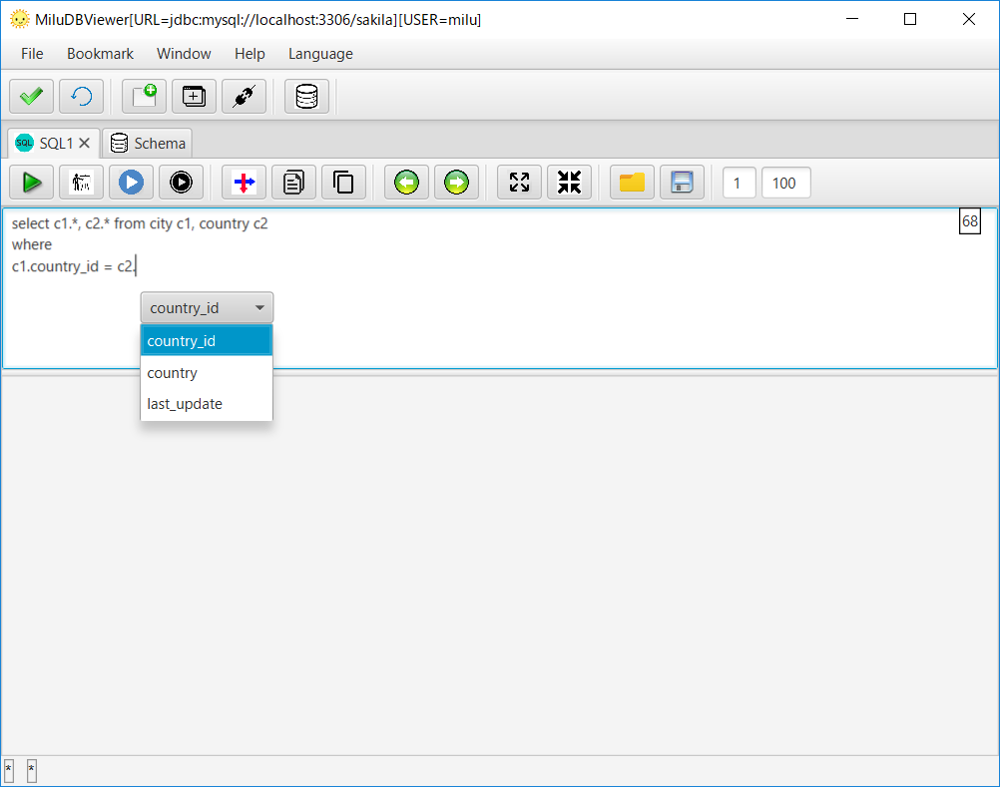

[English](README.md)

# 概要

- DB上のデータ閲覧・SQLコマンドを発行可能なGUIツール
- **サポートしているDB: Oracle, PostgreSQL, MySQL, Cassandra, SQLite, SQLServer**. 将来的には、JDBCに準拠しているDBを、もっと追加する予定です。
- マルチ プラットフォーム: Windows, Linux, MacOS.
- マルチ　言語: 日本語・英語・フランス語・スペイン語・中国語.
- フリー＆オープンソース.

# ダウンロード

[https://sourceforge.net/projects/miludbviewer/files/?source=navbar](https://sourceforge.net/projects/miludbviewer/files/?source=navbar)

# インストールと起動

1. Open JDK 22+Open JavaFX22 以上をダウンロードしてください。
   [Open JDK 22 ダウンロード - jdk.java.net](https://jdk.java.net/)  
   [Open JavaFX 22 ダウンロード - gluonhq.com/](https://gluonhq.com/products/javafx/)  

2-1. Windows
(1-1) Open JDK 22をインストール
私の場合, C:\Program Files\Java\jdk-22  
(1-2) Open JavaFX 22をインストール
私の場合, C:\Program Files\Java\javafx-sdk-22  
(1-3) jdk/binを環境変数PATHに追加
私の場合, C:\Program Files\Java\jdk-22\bin  
(1-4) javafx/lib環境変数PATH_TO_FXに追加  
私の場合, C:\Program Files\Java\javafx-sdk-22\lib  
[Run HelloWorld using JavaFX](https://openjfx.io/openjfx-docs/#install-javafx)  
(2-1) "MiluDBViewer_Setup\*.\*.\*.exe"を実行してインストールしてください。  
(2-2) "*your path*\MiluDBViewer.bat" を実行してください。  

2-2. Linux
(1-1) Open JDK 22をインストール  
私の場合, /opt/java/jdk-22  
(1-2) Open JavaFX 22をインストール 
私の場合, /opt/java/javafx-sdk-22  
(1-3) jdk/binを環境変数PATHに追加  
私の場合, /opt/java/jdk-22/bin  
(1-4) javafx/lib環境変数PATH_TO_FXに追加  
私の場合, /opt/java/javafx-sdk-22/lib  
[Run HelloWorld using JavaFX](https://openjfx.io/openjfx-docs/#install-javafx)  
(3-1) MiluDBViewer\*.\*.\*.tgzを解凍してください。  
(3-2) $ cd *your path* 
(3-3) $ ./MiluDBViewer\*\*\*.sh を実行してください。  

# 動作確認したデータベース(MiluDBViewer0.4.0_jdk22)
(1) Cassandra 4.1.4
(2) MySQL 8.0.36
(3) Oracle Database 23c Free
(4) PostgreSQL 14.11
(5) SQLite 3.45.1
(6) Microsoft SQLServer 2017
(7) MongoDB 3.6.5

# 動作確認したデータベース(MiluDBViewer0.3.9_jdk21)
(1) Cassandra 3.9.0
(2) MySQL 5.7.20/8.0.11
(3) Oracle 12c Release2/11g Release2
(4) PostgreSQL 10.4/10.1
(5) SQLite 3.23.1
(6) Microsoft SQLServer 2017
(7) MongoDB 3.6.5

# ポイント

## 縦方向のデータコピー
自身で作成したアプリケーションのデータ遷移をチェックするために用います。
たくさんのカラムがあるテーブル上のデータをみるのに、よいかと思います。

1. 縦方向にデータコピー

2. Excel, Open Office, Googleスプレッドシートのような表計算アプリに貼り付けます

## スクリプトの実行

1. "Result"タブに全SQLの実行結果が表示されます

2. "Script#"タブに各SQLの実行結果が表示されます 

3. 選択されたSQLのみの実行も可能です

## 補完

1. "."を契機に補完候補を表示します

## スキーマ表示

1. スキーマがもつデータを表示します。現バージョンでは、"表・ビュー => 定義. プロシージャ => ソース"を表示します.

サポートしているオブジェクト一覧

x|Table|View|Materialized View|Function|Aggregate|Procedure|Package|Type|Trigger|Sequence
-|-----|----|-----------------|--------|---------|---------|-------|----|-------|--------
Cassandra|〇|×|〇|〇|〇|×|×|〇|×|×
MongoDB|〇|×|×|×|×|×|×|×|×|×
MySQL|〇|〇|×|〇|×|〇|×|〇|×
Oracle|〇|〇|〇|〇|×|〇|〇|〇|〇|〇
PostgreSQL|〇|〇|〇|〇|×|×|×|〇|〇|〇
SQLite|〇|〇|×|×|×|×|×|×|×|×
SQLServer|〇|〇|×|〇|×|〇|×|〇|〇|〇

## ER図

1. 外部キーをたどっていくことでER図を作成しています

# DB接続の設定

- [Cassandra](doc/ja/START_Cassandra.md)
- [MongoDB](doc/ja/START_MongoDB.md)
- [MySQL](doc/ja/START_MySQL.md)
- [Oracle](doc/ja/START_Oracle.md)
- [PostgreSQL](doc/ja/START_PostgreSQL.md)
- [SQLite](doc/ja/START_SQLite.md)
- [SQLServer](doc/ja/START_SQLServer.md)

