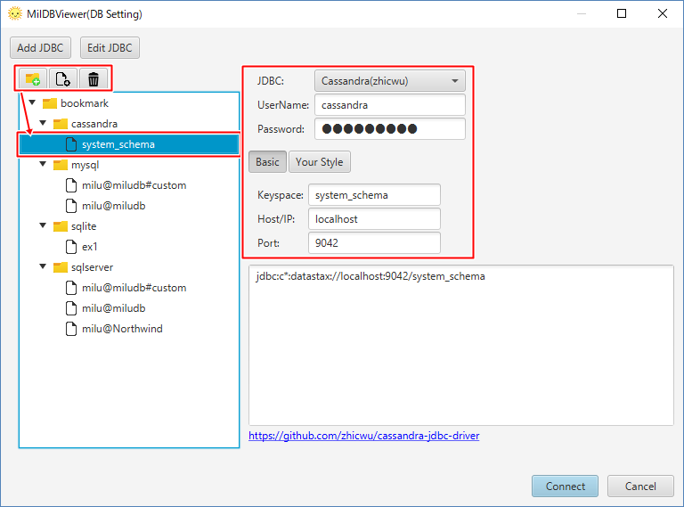
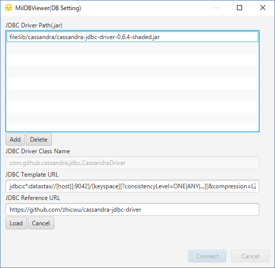

# Configuration to Connect to "Cassandra"

1. Start MiluDBViewer.

2. Create an icon for connection on bookmark. Select "Cassandra". Input "Keyspace" & "Host/IP". Click "Connect".

# JDBC for Cassandra

JDBC for Cassandra is attachted. Click "Edit JDBC" to check the configuration.

