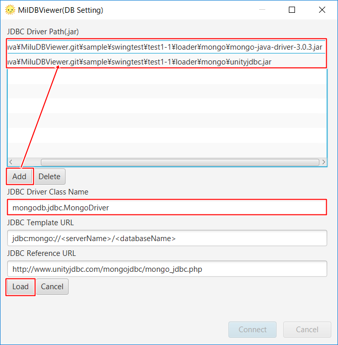
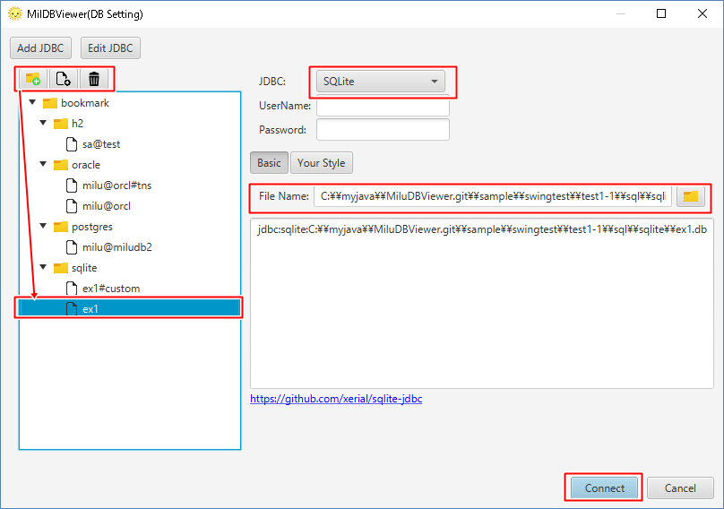

# Configuration to Connect to "MongoDB"

1. Download JDBC for MongoDB. [http://unityjdbc.com/mongojdbc/mongo_jdbc.php](http://unityjdbc.com/mongojdbc/mongo_jdbc.php).

2. Start MiluDBViewer. Click "Add JDBC"

3. Choose "JDBC Driver Path(.jar)" by "Add". Input "mongodb.jdbc.MongoDriver" as "JDBC Driver Class Name". Other items are optional. Click "Load".

4. Create an icon for connection on bookmark. Select "MongoDB(Unity)". Input "DB Name","Host/IP","Port". Click "Connect".

