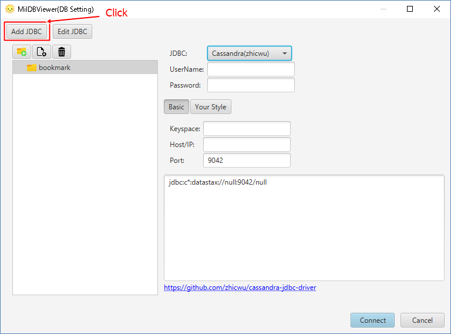
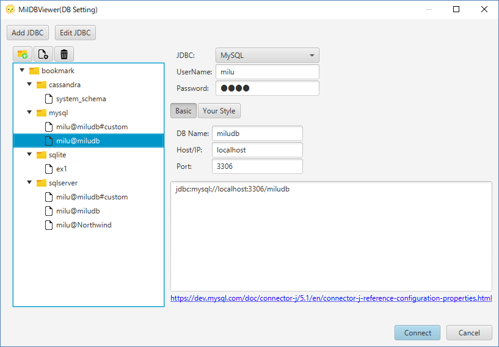

# Configuration to Connect to "MySQL"

1. Start MiluDBViewer.

2. Create an icon for connection on bookmark. Select "MySQL". Input "DB Name" & "Host/IP". Click "Connect".

# JDBC for MySQL

JDBC for MySQL is attachted. Click "Edit JDBC" to check the configuration.

