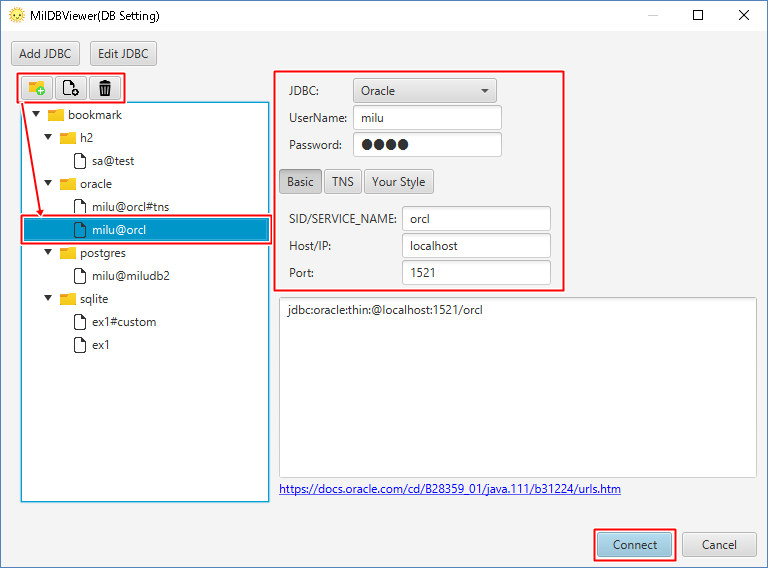
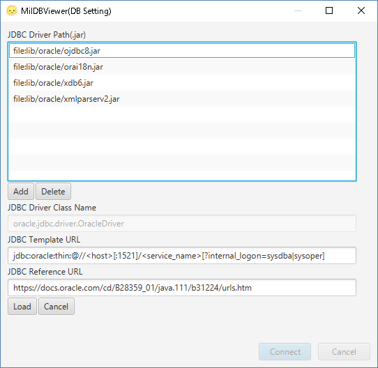

# Configuration to Connect to "Oracle"

1. Start MiluDBViewer.

2. Create an icon for connection on bookmark. Select "Oracle". Choose "File Name". Click "Connect".

# JDBC for Oracle

JDBC for Oracle is attachted. Click "Edit JDBC" to check the configuration.

jar|note
---|----
ojdbc8.jar|Must Item
orai18n.jar|Some japanese characters are not human readable, if not.
xdb6.jar|Necessary to see "XMLType" data.
xmlparserv2.jar|Necessary to see "XMLType" data.

