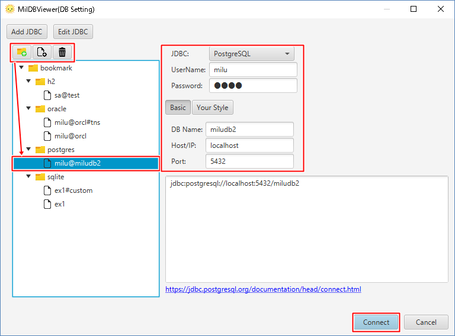
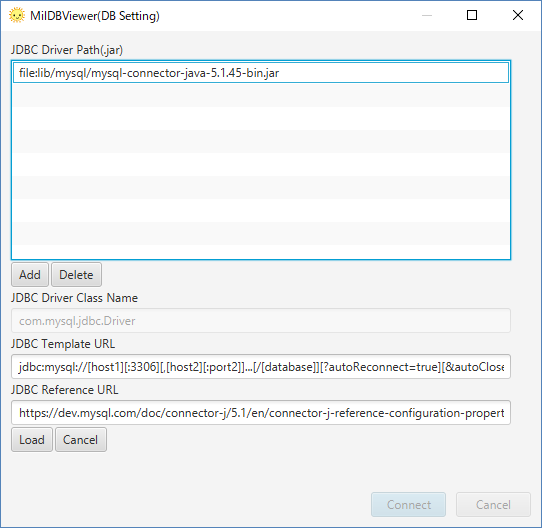

# Start to Connect "PostgreSQL"

1. Start MiluDBViewer.

2. Create an icon for connection on bookmark. Select "Oracle". Choose "File Name". At last, Click "Connect".

# JDBC for PostgreSQL

JDBC for PostgreSQL is attachted. Click "Edit JDBC" to check the configuration.

