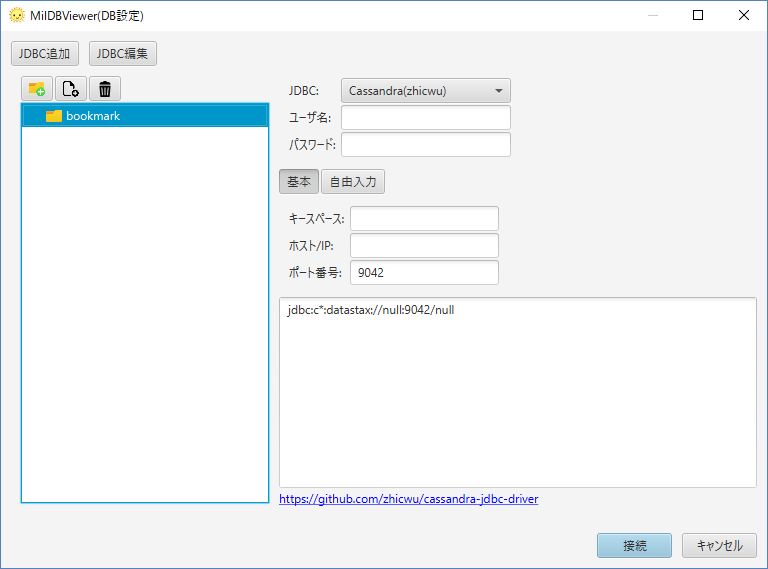

# Start to Connect "SQLite"

1. Download JDBC for SQLite. [https://bitbucket.org/xerial/sqlite-jdbc/downloads/](https://bitbucket.org/xerial/sqlite-jdbc/downloads/).

2. Start MiluDBViewer. Click "Add JDBC"

3. Choose "JDBC Driver Path(.jar)" by "Add". "JDBC Driver Class Name" is "org.sqlite.JDBC". Other items are optional. At last, click "Load".

4. Create an icon for connection on bookmark. Select "SQLite". Choose "File Name". At last, Click "Connect".

