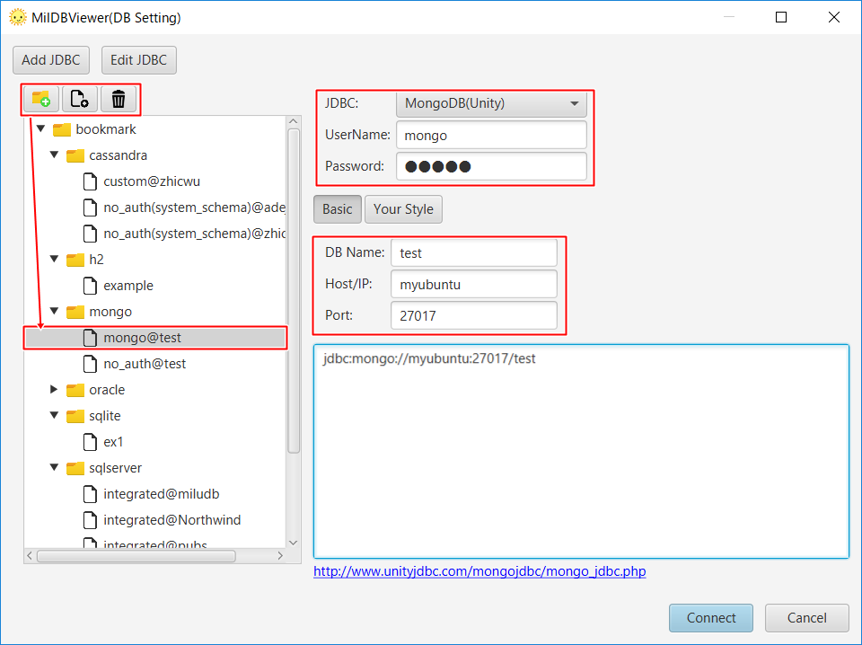

# MongoDBへ接続するときの設定

1. MongoDB用JDBCをダウンロード. [http://unityjdbc.com/mongojdbc/mongo_jdbc.php](http://unityjdbc.com/mongojdbc/mongo_jdbc.php).

2. MiluDBViewerを起動. "JDBC追加"をクリック.

3. "JDBCドライバ パス(.jar)"に追加. "JDBCドライバ クラス名"に"mongodb.jdbc.MongoDriver"を入力. その他の項目は任意入力です. "ロード"をクリック.

4. 接続アイコンをブックマーク上に作成します. "MongoDB(Unity)"を選択、"DB名","ホスト/IP","ポート"を入力し、"接続"をクリック.

