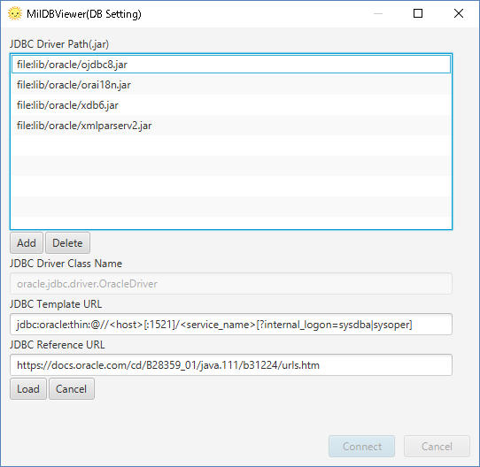

# Oracleへ接続するときの設定

1. MiluDBViewerを起動

2. 接続アイコンをブックマーク上に作成します. "Oracle"を選択し、接続先SID/SERVICE_NAME/ホストを入力したら、"接続"ボタンをクリックしてください.

# Oracle用JDBCについて

Oracle用JDBCはインストーラに付属しています.どのような設定か確認する場合、"JDBC編集"をクリックしてください.

jar|note
---|----
ojdbc8.jar|Must Item
orai18n.jar|いれないと、いくつかの日本語が文字化けしますないと、いくつかの日本語が文字化けします
xdb6.jar|"XMLType"のデータを閲覧する際必要となります
xmlparserv2.jar|"XMLType"のデータを閲覧する際必要となります

